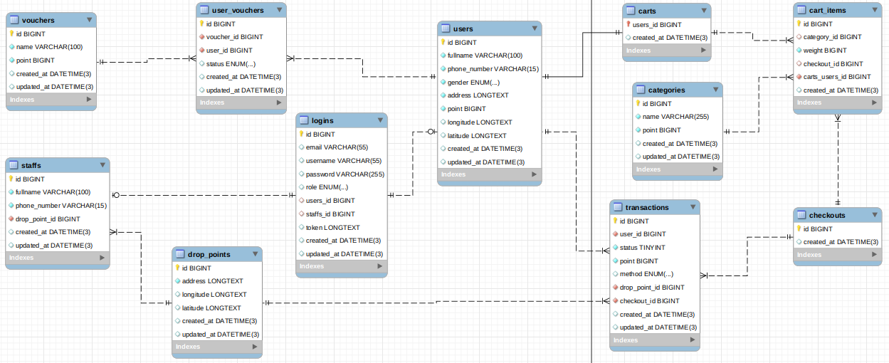

# SUIT - (Sampah jadi dUIT)
Turn your trash into rewards

[](https://pkg.go.dev/gorm.io/gorm?tab=doc)
[](https://github.com/labstack/echo)


# Table of Content
- [Description](#description)
- [How to use](#how-to-use)
- [Endpoints](#endpoints)
- [Credits](#credits)

# Description
This is final project of alterra academy

# How to use
- Install Go and MySQL or (install docker and docker-compose)
- Clone this repository in your $PATH:
```
$ git clone https://github.com/darienkentanu/suit
```
- add your '.env' files containing following env variabel:
```
DB_USERNAME, DB_PASSWORD, DB_HOST, DB_PORT, DB_NAME,
DB_TEST_USERNAME, DB_TEST_PASSWORD, DB_TEST_HOST, DB_TEST_PORT, DB_TEST_NAME
```
$ go run main.go or $ docker-compose up --build -d

```
after that import the file-insert.sql to your database

```


# Endpoints

| Method | Endpoint | Description| Authentication | Authorization
|:-----|:--------|:----------| :----------:| :----------:|
| POST  | /register | Register a new user | No | No
| POST  | /registerstaff | Register a new staff | No | No
| POST | /login | Login existing user or staff| No | No
|---|---|---|---|---|
| GET | /users | Get list of all user | Yes | Yes
| GET | /staff | Get list of all staff | Yes | Yes
|---|---|---|---|---|
| PUT | /profile | Update user profile or staff | Yes | No
| GET | /profile | Get user profile or staff | Yes | No
|---|---|---|---|---|
| GET | /droppoints | Get list of all drop point | No | No
| POST | /droppoints | Add list of drop point | Yes | Yes
| PUT | /droppoints/:id | Update drop point | Yes | Yes
| DELETE | /droppoints/:id | Delete drop point | Yes | Yes
|---|---|---|---|---|
| GET | /categories | Get list of all category | No | No
| POST | /categories | Add category by staff | Yes | Yes
| PUT | /categories/:id | Update category by staff | Yes | Yes
| DELETE | /categories/:id | Delete category by staff | Yes | Yes
|---|---|---|---|---|
| GET | /vouchers | Get list of all voucher | No | No
| POST | /vouchers | Add voucher by staff | Yes | Yes
| PUT | /vouchers/:id | Update voucher by staff | Yes | Yes
| DELETE | /vouchers/:id | Delete voucher by staff | Yes | Yes
|---|---|---|---|---|
| POST | /cart | Add category list to user cart | Yes | No
| GET | /cart | Get list of user all cart item | Yes | No
| PUT | /cartitems/:id | Update user cart item by id | Yes | No
| DELETE | /cartitems/:id | Delete user cart item by id | Yes | No
|---|---|---|---|---|
| POST | /checkoutbypickup | Checkout by request pickup | Yes | No
| POST | /checkoutbydropoff | Checkout by dropoff on drop point | Yes | No
| POST | /verification/:id | Verification by transaction id | Yes | Yes
|---|---|---|---|---|
| GET | /uservouchers | Get list of all user voucher | Yes | No
| POST | /claim/:id | Claim voucher by voucher id | Yes | No
| POST | /redeem/:id | Redeem voucher by voucher id | Yes | No
|---|---|---|---|---|
| GET | /transactions | Get list of all transaction | Yes | No
| GET | /transactionbydroppoint/:id | Get list of all transaction by drop points id (staff only) | Yes | Yes
| GET | /transactionreport/:range | Get list of all transaction -daily - weekly -monthly | Yes | No
| GET | /totaltransaction | Get list of all total weight of transaction | Yes | No
| GET | /totaltransaction/:range | Get list of all total weight of transaction -daily - weekly -monthly | Yes | No
|---|---|---|---|---|


<br>

## Credits

- [Darien Kentanu](https://github.com/darienkentanu) (Author and maintainer)
- [Rizka Khairani](https://github.com/rizkakhairani) (Author and maintainer)
- [Adi Cipta Pratama](https://github.com/adicipta) (Author and maintainer)
